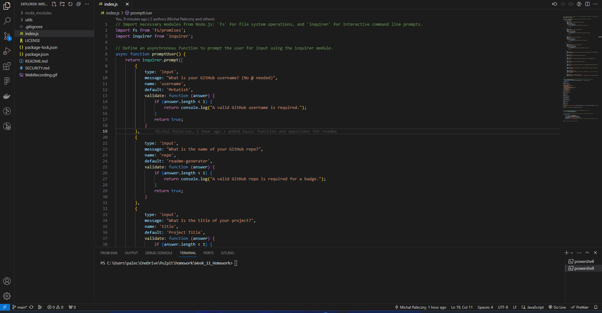

# Professional README Generator

## Description

The Professional README Generator is a command-line application designed to simplify the process of creating a well-structured README file for your projects. This tool prompts the user for inputs regarding their project's details, such as title, description, installation instructions, and more, generating a markdown file that can be directly used or further customized. This project aims to save developers time and effort, ensuring that their GitHub repositories are presented professionally.

## Table of Contents

- [Description](#description)
- [Installation](#installation)
- [Usage](#usage)
- [Features](#features)
- [Working Demo](#working-demo)
- [Credits](#credits)
- [Technologies Used](#technologies-used)

## Installation

To install the README Generator, follow these steps:

1. Clone the repository to your local machine using `git clone https://github.com/MrKatrish/readme-generator.git`
2. Navigate to the cloned directory and run `npm install` to install all necessary dependencies.
3. Ensure Node.js is installed on your machine to execute the application.

## Usage

To use the README Generator:

1. Navigate to the root directory of the project in your terminal.
2. Run the command `node index.js` to initiate the prompts.
3. Answer each prompt regarding your project's details. Your inputs will be compiled into a README.md file.
4. Once all prompts are answered, the README.md file will be generated in the current directory. You can then review and make any necessary adjustments.

## Features

- Interactive command-line prompts to gather project information
- Customizable sections including installation, usage, credits, and more
- Automatic table of contents generation
- Supports multiple licenses selection
- Option to include a list of technologies used in the project

## Working Demo

## Credits

This project was inspired by the need for a quick and efficient way to create README files for open source projects. Special thanks to:

- Node.js community for providing invaluable resources.
- Inquirer.js for their easy-to-use command-line interface.
- All contributors who tested the application and provided feedback.
- Our edX Instructors and TA.

## Technologies Used

- JavaScript
- Node.js
- Inquirer.js

Your feedback and contributions are welcome! Please feel free to submit issues or pull requests to the repository.

